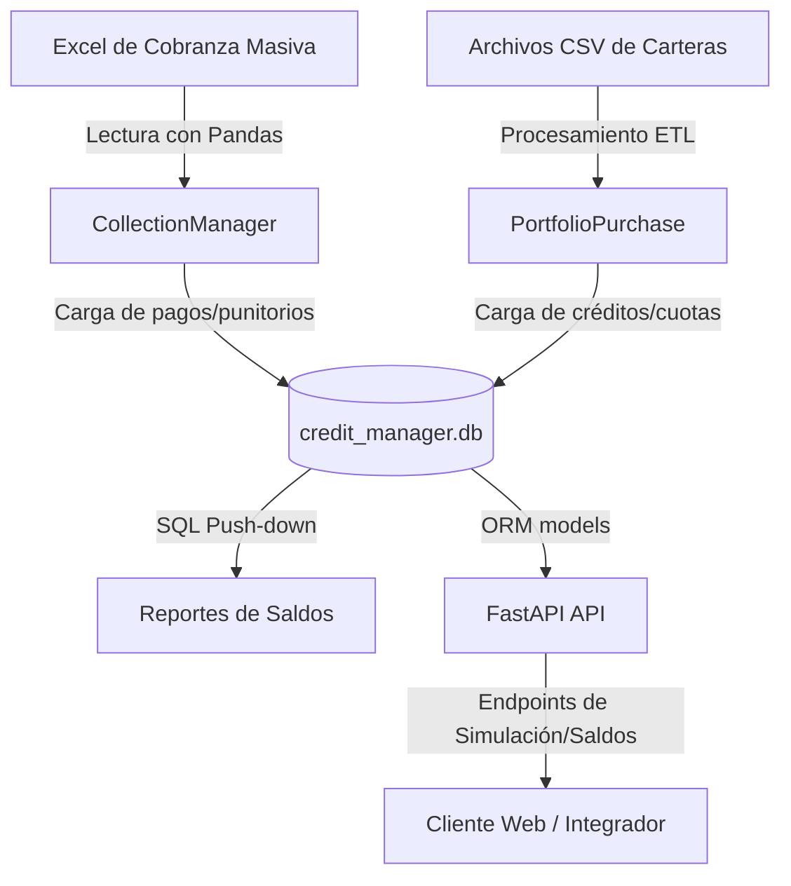

# 💳 Credit Manager - Core Engine

Sistema de gestión de carteras de créditos, motores de amortización financiera e ingesta de datos desarrollado en Python. Este proyecto permite la administración de activos financieros, cálculo de cuotas mediante sistema francés, importación masiva de carteras, procesamiento de cobranzas (con soporte para transacciones atómicas y rollback) y generación de reportes analíticos de saldos.

## 🚀 Características Principales

* **Motor de Amortización**: Cálculo preciso de cuotas mediante el Sistema Francés utilizando `numpy-financial` con forzado de fechas de vencimiento y cálculo dinámico de componentes (capital, interés e IVA).
* **Ingesta de Carteras (ETL)**: Ingesta masiva y modular de carteras desde archivos CSV crudos (personas, préstamos, cuotas). Implementa validación de integridad referencial, casteo seguro de nulos (`NaN`/`NaT`) y carga a la base de datos a través de transacciones ACID.
* **Cobranzas Masivas Atómicas**: Procesamiento masivo de pagos y cancelaciones (estándar o anticipadas) desde planillas de Excel. Cuenta con control transaccional completo: si algún registro tiene problemas (por ejemplo, falta de deuda o discrepancias en los montos) o se produce una excepción, se ejecuta un `rollback` automático de toda la sesión para asegurar la consistencia y evitar guardados parciales.
* **Gestión de Punitorios (Penalties)**: Generación automática de créditos independientes de tipo punitorio a partir del excedente o sobrante del cobro de un cliente, integrando el cobro en una única operación atómica.
* **Reportes Analíticos Optimizados**: Generación rápida de reportes de saldos de cartera (`saldos()`). Utiliza técnicas de *SQL push-down* para delegar el filtrado al motor SQLite y vectorización lógica en Pandas para evitar saturar la memoria RAM.
* **Arquitectura de Datos ORM**: Modelado relacional estructurado con SQLAlchemy. Registra operaciones granulares de la cartera (Compra, Venta y Recompra de carteras con o sin recurso).
* **Configuración Validada**: Gestión centralizada y fuertemente tipada de variables de entorno mediante Pydantic y Pydantic-Settings.
* **API Web**: Endpoints desarrollados con FastAPI para realizar simulaciones de cuotas de crédito en tiempo real y consultar reportes de saldos de cartera en formato JSON.

## 📐 Arquitectura del Sistema



## 🛠️ Tecnologías Utilizadas

* **Lenguaje**: Python 3.14.4 (Backend) / JavaScript (Frontend)
* **Manipulación de Datos**: Pandas, NumPy & NumPy-Financial
* **ORM & Base de Datos**: SQLAlchemy & SQLite (forzando `PRAGMA foreign_keys=ON`)
* **Configuración y Validación**: Pydantic & Pydantic-Settings
* **Framework Web (Backend)**: FastAPI & Uvicorn
* **Framework Web (Frontend)**: React & Vite (v2) / HTML & Vanilla JS (v1)
* **Pruebas**: Pytest
* **Lectura de Archivos**: openpyxl (para lectura de archivos Excel)

## 📁 Estructura del Proyecto

```text
Credit_Manager/
├── .env                  # Variables de entorno y metadatos de la empresa administradora
├── data/                 # Almacenamiento local de la base de datos SQLite y archivos CSV/Excel
├── frontend/             # Cliente web v1 (Vanilla JS, HTML, CSS)
├── frontend-v2/          # Cliente web v2 moderno (React, Vite)
├── notebooks/            # Notebooks Jupyter para pruebas interactivas y auditorías
├── src/
    ├── api/              # Endpoints, ruteo y configuración del servidor FastAPI
    │   ├── main.py       # Punto de entrada de la API web
    │   └── routes/       # Definición de rutas adicionales de la API
    ├── database/         # Configuración del motor, conexión de sesión y modelos de SQLAlchemy
    │   ├── connection.py # Engine de la base de datos y fábrica de sesiones
    │   ├── models.py     # Definición de las tablas (Cliente, Credito, Cuota, Cobranza, etc.)
    │   └── seed_geography.py # Poblado de tablas geográficas (Provincias)
    ├── imports/          # Módulos de ingesta y ETL masivo
    │   ├── init_socios.py    # Inicializador automático de socios comerciales
    │   └── cql/              # Procesadores de reportes de Neocredit
    │       ├── read.py       # Selector de directorio y lector de planillas base
    │       ├── clients.py    # Procesamiento y carga optimizada de clientes
    │       ├── credits.py    # Vectorización financiera (TNA) y carga de créditos
    │       └── quota_and_coll.py # Carga segura por chunks de cuotas y cobranzas
    ├── logic/            # Reglas de negocio y motores financieros
    │   ├── amortization.py   # Motor de cálculo del sistema Francés
    │   ├── collections.py    # Gestor de cobranzas estándar, anticipadas e ingestas masivas
    │   └── penalties.py      # Gestor para la generación de créditos de punitorio por sobrantes
    ├── portfolio/        # Módulos de adquisición y cesión (venta/compra/recompra) de carteras
    │   ├── purchase.py   # Importación y validación de carteras adquiridas
    │   └── sell.py       # Proceso de cesión de carteras
    ├── reports/          # Reportes y analítica de saldos e intereses devengados
    │   └── balances.py   # Cálculo vectorial de saldos y deuda morosa/pendiente
    └── utils/            # Funciones auxiliares comunes (formateo de fechas, selección de archivos, etc.)
└── tests/                # Pruebas unitarias y de integración (pytest)
```

## ⚙️ Instalación y Configuración

### 1. Clonar el repositorio y acceder a la carpeta
```bash
git clone https://github.com/JuanMCarini/Credit_Manager.git
cd Credit_Manager
```

### 2. Configurar el Entorno Virtual
Crea y activa un entorno virtual en Python:
```bash
# En Windows (PowerShell)
python -m venv venv
.\venv\Scripts\Activate.ps1

# En Linux/macOS
python3 -m venv venv
source venv/bin/activate
```

### 3. Instalar Dependencias
Instala los paquetes requeridos especificados en `requirements.txt`:
```bash
pip install -r requirements.txt
```

### 4. Configurar Variables de Entorno
Crea un archivo `.env` en la raíz del proyecto basándote en la configuración de la empresa o los valores requeridos. Ejemplo:
```env
ADMINISTRADORA_NAME="YOYO S.A."
ADMINISTRADORA_CUIT="30713257880"
```

## 🚀 Uso y Ejecución

### Ejecutar la API en modo Desarrollo
Para levantar el servidor FastAPI localmente:
```bash
uvicorn src.api.main:app --reload
```
Una vez iniciado, podrás acceder a la documentación interactiva en:
- Swagger UI: [http://127.0.0.1:8000/docs](http://127.0.0.1:8000/docs)
- Redoc: [http://127.0.0.1:8000/redoc](http://127.0.0.1:8000/redoc)

### Ejecutar Pruebas y Simulaciones en Jupyter Notebook
Para realizar pruebas interactivas de ingesta de carteras y procesamiento de cobros masivos, abre el entorno de Jupyter Notebooks:
```bash
jupyter notebook notebooks/test.ipynb
```
Dentro de este notebook podrás resetear el esquema de base de datos, repoblar las tablas geográficas, procesar carteras enteras y ejecutar cobros masivos sobre archivos Excel.