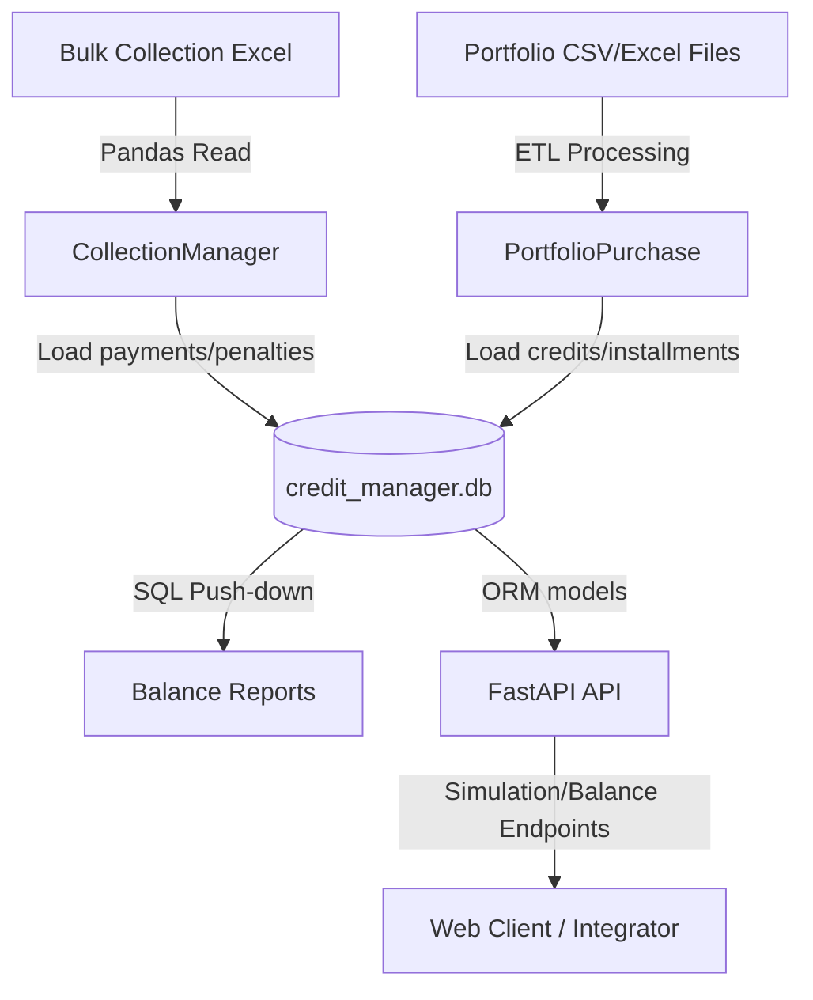

# 💳 Credit Manager - Core Engine

A credit portfolio management system, financial amortization engine, and data ingestion pipeline developed in Python. This project allows for the administration of financial assets, calculation of installments using the French amortization system, bulk portfolio imports, collections processing (with full atomic transaction and rollback support), and generation of analytical balance reports.

## 🚀 Main Features

* **Amortization Engine**: Precise calculation of installments via the French System using `numpy-financial`, enforcing due dates and dynamically calculating components (principal, interest, and VAT).
* **Portfolio Ingestion (ETL)**: Modular and bulk ingestion of portfolios from raw CSV/Excel files (individuals, loans, installments). Implements referential integrity validation, safe null-casting (`NaN`/`NaT`), and database loading through ACID transactions.
* **Atomic Bulk Collections**: Mass processing of payments and settlements (standard or early payoffs) from Excel spreadsheets. Features full transactional control: if any record encounters an issue (e.g., lack of debt or amount discrepancies) or an exception occurs, an automatic `rollback` of the entire session is triggered to ensure consistency and prevent partial saves.
* **Penalties Management**: Automatic generation of independent penalty credits from a client's surplus or overpayment, integrating the collection into a single atomic operation.
* **Optimized Analytical Reports**: Fast generation of portfolio balance reports (`saldos()`). Utilizes *SQL push-down* techniques to delegate filtering to the SQLite engine and logical vectorization in Pandas to prevent RAM saturation.
* **ORM Data Architecture**: Structured relational modeling with SQLAlchemy. Records granular portfolio operations (Purchase, Sale, and Repurchase of portfolios with or without recourse).
* **Validated Configuration**: Centralized and strongly-typed management of environment variables using Pydantic and Pydantic-Settings.
* **Web API**: Endpoints developed with FastAPI to perform real-time credit installment simulations and query portfolio balance reports in JSON format.

## 📐 System Architecture



## 🛠️ Technologies Used

* **Language**: Python 3.14.4
* **Data Manipulation**: Pandas, NumPy & NumPy-Financial
* **ORM & Database**: SQLAlchemy & SQLite (forcing `PRAGMA foreign_keys=ON`)
* **Configuration & Validation**: Pydantic & Pydantic-Settings
* **Web Framework**: FastAPI & Uvicorn
* **File Reading**: openpyxl (for reading Excel files)

## 📁 Project Structure

```text
Credit_Manager/
├── .env                  # Environment variables and administrative company metadata
├── data/                 # Local storage for the SQLite database and CSV/Excel files
├── notebooks/            # Jupyter Notebooks for interactive testing and auditing
└── src/
    ├── api/              # FastAPI server endpoints, routing, and configuration
    │   ├── main.py       # Web API entry point
    │   └── routes/       # Definition of additional API routes
    ├── database/         # Engine configuration, session connection, and SQLAlchemy models
    │   ├── connection.py # Database engine and session factory
    │   ├── models.py     # Table definitions (Cliente, Credito, Cuota, Cobranza, etc.)
    │   └── seed_geography.py # Seeding of geographical tables (Provincias)
    ├── imports/          # Mass ingestion and ETL modules
    │   ├── init_socios.py    # Automatic initialization of commercial partners
    │   └── cql/              # Empresa Ficticia reports processors
    │       ├── read.py       # Directory selector and base spreadsheet reader
    │       ├── clients.py    # Optimized client processing and loading
    │       ├── credits.py    # Financial vectorization (TNA) and credit loading
    │       └── quota_and_coll.py # Safe chunked loading for installments and collections
    ├── logic/            # Business rules and financial engines
    │   ├── amortization.py   # French system calculation engine
    │   ├── collections.py    # Manager for standard, early, and bulk collections
    │   └── penalties.py      # Manager for generating penalty credits from surpluses
    ├── portfolio/        # Modules for portfolio acquisition and assignment (sell/purchase/repurchase)
    │   ├── purchase.py   # Import and validation of acquired portfolios
    │   └── sell.py       # Portfolio assignment process
    ├── reports/          # Reports and analytics for balances and accrued interests
    │   └── balances.py   # Vectorized calculation of balances and overdue/pending debt
    └── utils/            # Common auxiliary functions (date formatting, file selection, etc.)
```

## ⚙️ Installation and Setup

### 1. Clone the repository and access the folder
```bash
git clone https://github.com/JuanMCarini/Credit_Manager.git
cd Credit_Manager
```

### 2. Configure the Virtual Environment
Create and activate a virtual environment in Python:
```bash
# On Windows (PowerShell)
python -m venv venv
.\venv\Scripts\Activate.ps1

# On Linux/macOS
python3 -m venv venv
source venv/bin/activate
```

### 3. Install Dependencies
Install the required packages specified in `requirements.txt`:
```bash
pip install -r requirements.txt
```

### 4. Configure Environment Variables
Create a `.env` file in the root of the project based on the company's configuration or required values. Example:
```env
ADMINISTRADORA_NAME="YOYO S.A."
ADMINISTRADORA_CUIT="30713257880"
```

## 🚀 Usage and Execution

### Run the API in Development mode
To start the FastAPI server locally:
```bash
uvicorn src.api.main:app --reload
```
Once started, you can access the interactive documentation at:
- Swagger UI: [http://127.0.0.1:8000/docs](http://127.0.0.1:8000/docs)
- Redoc: [http://127.0.0.1:8000/redoc](http://127.0.0.1:8000/redoc)

### Run Tests and Simulations in Jupyter Notebook
To perform interactive tests of portfolio ingestion and mass collection processing, open the Jupyter Notebooks environment:
```bash
jupyter notebook notebooks/test.ipynb
```
Inside this notebook, you can reset the database schema, repopulate geographical tables, process entire portfolios, and execute bulk collections on Excel files.
